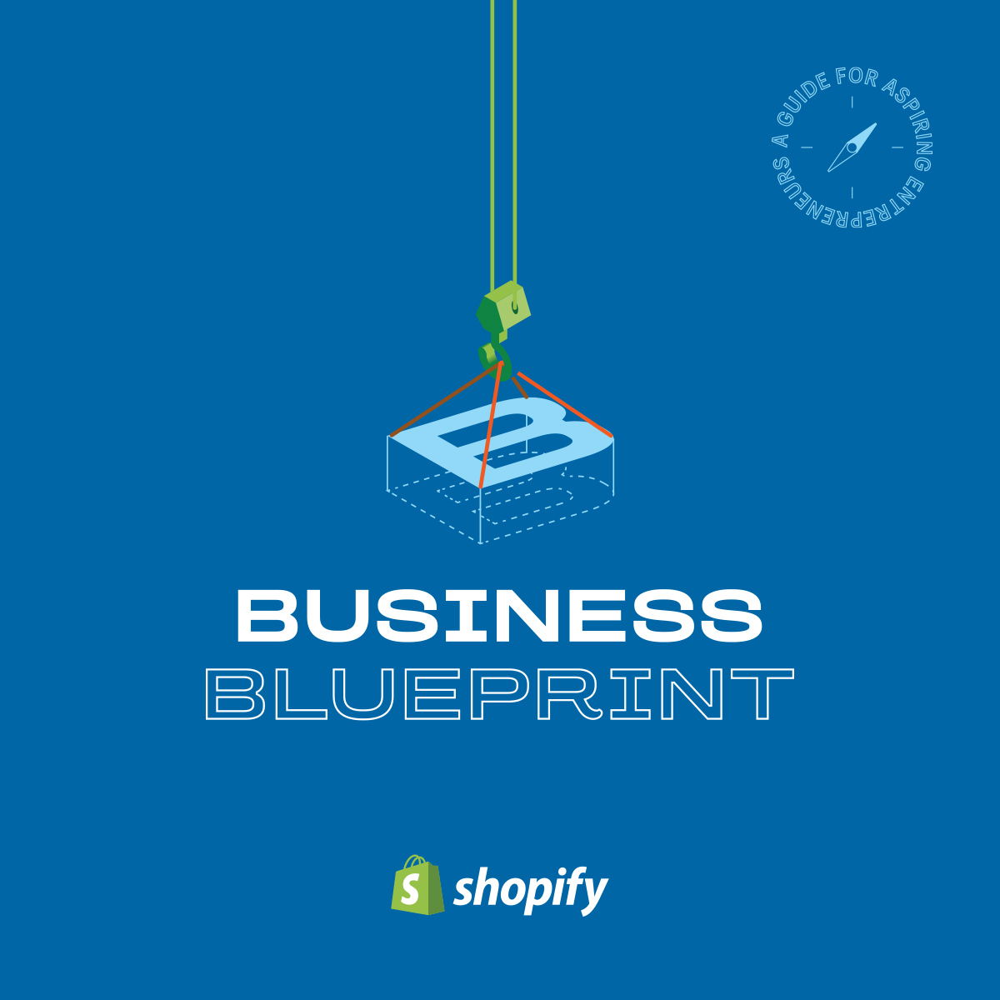

# Shopify Business Blueprint

A guide for aspiring entrepreneurs

<aside>
 **Get started building your business with Shopify –** [start your 14-day free Shopify trial today here.](https://www.shopify.com/?utm_source=notion&utm_medium=referral&utm_campaign=bb&utm_content=bae-bb-notion-template)

</aside>

<aside>
 **Get started building your operating system with Notion –** [startups may qualify for $1000 in Notion credit](https://www.notion.so/pages/shopify-notion-startup-partnership)

</aside>

# **Welcome to the Business Blueprint** 🎉

**If you’re reading this, congrats. You’ve already taken the first step towards writing your entrepreneurship story. Whether you’ve been working on a business idea for a while or are just starting out, only you can determine where your story will go next. Wherever that may be, we’re excited to support you.**

Entrepreneurship is a thrilling journey, full of many highs and learnings. We know there’s no perfect manual for starting a business, and translating your ideas into action can often be the most challenging part. That’s where the Shopify Business Blueprint comes in!

This Blueprint is designed to give you the tools, skills, and knowledge to start your own business. It’s filled with insights and exercises tailored to help early-stage entrepreneurs go from ideation to execution, and beyond.

You’ll find most sections take less than an hour to complete but feel free to take your time. Just like your business, it’s not meant to be built in a day! Work at your own pace and make sure to celebrate your milestones along the way (there will be many!).

Entrepreneurship is a rewarding journey where you’ll have the opportunity to create something that’s truly yours. Pursuing your passions and building a business you love will be one of the most fulfilling chapters of your life.

We’re excited to help you write it.
Cheers to the next chapter; we can’t wait to see what you build.

**Harley Finkelstein, President, Shopify**

# Get Started 👇

[1: Planning](https://www.notion.so/1-Planning-1f298309974d816594e7e928ecc51ca1?pvs=21)

[2: Framing](https://www.notion.so/2-Framing-1f298309974d81e08304c70b50752710?pvs=21)

[3: Building](https://www.notion.so/3-Building-1f298309974d813d902ff644261a0cb4?pvs=21)

[4: Growing](https://www.notion.so/4-Growing-1f298309974d815faf03d636176a24e9?pvs=21)

---

[About Shopify](https://www.notion.so/About-Shopify-1f298309974d81059fd4c6c90f2f584b?pvs=21)

---

<aside>

# **Redefining “Entrepreneur’’**

Our understanding of the word “entrepreneur” is constantly changing. Over the last few generations, that term has evolved to no longer be limited to a particular group or circumstances. 

Modern entrepreneurs are redefining the word to include anyone who is reaching for independence and working for themselves. The category has broadened to include all kinds of artists, innovators, and creators. Some entrepreneurs provide services or sell intangible assets. Others sell their handmade products, like candles or jewelry. Some curate products to sell in subscription boxes or retail stores. Others grow audiences online by making content and selling courses or merchandise. And still others dream up new categories we haven’t even heard of yet. 

The future of entrepreneurship contains more diverse voices, more varieties of businesses, and endless opportunities. While entrepreneurs may differ in their offerings, there are two things all of them have in common:

1. Ambition
2. Momentum

We created The Business Blueprint to help you get started, to combine your ambition and momentum and transform them into a business of your own. The Blueprint is designed to give you a high-level overview of where and how to start a business. By the end of the Blueprint, you’ll have the tools and structure you need to continue pushing your business forward. 

Next up: creating your business.

</aside>

### [Let’s Get Started!](https://www.notion.so/1-Planning-1f298309974d816594e7e928ecc51ca1?pvs=21)

<aside>
👉 First up is [1: Planning](https://www.notion.so/1-Planning-1f298309974d816594e7e928ecc51ca1?pvs=21)

</aside>

<aside>
🌐 **Bonus Content:** Read this story on the Shopify Blog about an up-and-coming founder getting their business started and redefining “entrepreneur.”

[**Empowering Phenomenal Women Everywhere, One Shirt at a Time**](https://www.shopify.com/blog/empowering-phenomenal-women)

</aside>

---

# Start your business journey with Shopify

Try Shopify for free, and explore all the tools and services you need to start, run, and grow your business.

### [Start 14-Day Free Trial](https://www.shopify.com/?utm_source=notion&utm_medium=referral&utm_campaign=bb&utm_content=bae-bb-notion-template)

Get started building your operating system with Notion - [startups may qualify for $1000 in Notion credit](https://www.notion.so/pages/shopify-notion-startup-partnership)

[https://embed.notionlytics.com/wt/ZXlKd1lXZGxTV1FpT2lKbE1qUTFaRGhsTXpZM09HSTBZV1kyWWpZMU5XWXhaVFprT1dRd01UZG1OaUlzSW5kdmNtdHpjR0ZqWlZSeVlXTnJaWEpKWkNJNkltUnJiMHRCY21OTllqbG5VSE53WkZkc1lrRnpJbjA9](https://embed.notionlytics.com/wt/ZXlKd1lXZGxTV1FpT2lKbE1qUTFaRGhsTXpZM09HSTBZV1kyWWpZMU5XWXhaVFprT1dRd01UZG1OaUlzSW5kdmNtdHpjR0ZqWlZSeVlXTnJaWEpKWkNJNkltUnJiMHRCY21OTllqbG5VSE53WkZkc1lrRnpJbjA9)